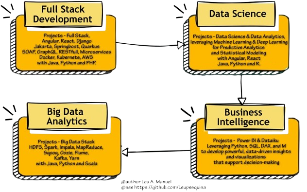

# 👋 Hi, I'm Leu Manuel

   

- I'm a **Full Stack Developer** and **Credit Risk Model Analyst** with over **7+ years of experience** working in diverse domains like full stack development, machine learning, backend development, and data engineering.

-  💼 Checkout My GitHub Repositories: [Full Stack](https://github.com/your-username/system-design), [Data Science](https://github.com/your-username/low-level-design), [Big Data Analytics](https://github.com/your-username/leetcode-solutions),[ Business Intelligence](https://github.com/your-username/behavioral-interviews)

- Feel free to explore and contribute to any of my repositories!

<!-- Image Map Generated by http://www.image-map.net/ -->

<map name="image-map">
    <area target="_blank" alt="Portfolio-FullStack" title="Portfolio-FullStack" href="https://github.com/Leupesquisa/FullStack-Development" coords="245,153,6,3" shape="rect">
    <area target="_blank" alt="Portfolio-DataScience" title="Portfolio-DataScience" href="https://github.com/Leupesquisa/Portfolio-DataScience" coords="605,160,360,2" shape="rect">
    <area target="_blank" alt="Portfolio-BigDataAnalytcs" title="Portfolio-BigDataAnalytcs" href="https://github.com/Leupesquisa/BigDataAnalytics" coords="9,201,251,374" shape="rect">
    <area target="_blank" alt="Portfolio-BI" title="Portfolio-BI" href="https://github.com/Leupesquisa/Portfolio-BI" coords="619,372,376,204" shape="rect">
</map>

# 💻 Tech Stack:

